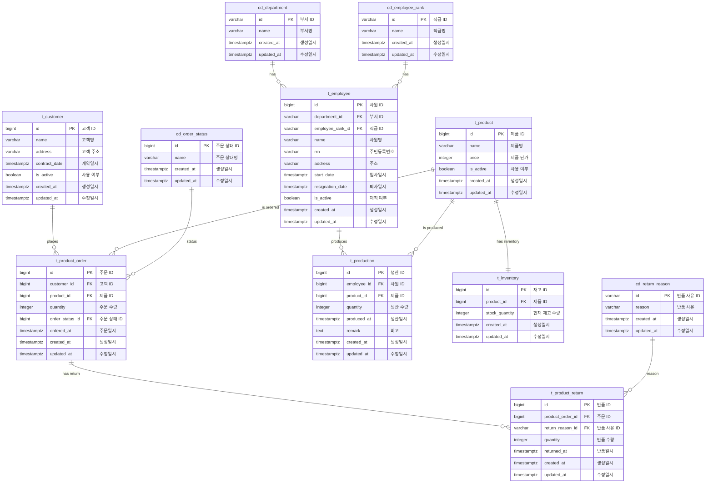

# 제조사 ERP ERD

```mermaid
erDiagram
    cd_department {
        varchar id PK "부서 ID"
        varchar name "부서명"
        timestamptz created_at "생성일시"
        timestamptz updated_at "수정일시"
    }

    cd_employee_rank {
        varchar id PK "직급 ID"
        varchar name "직급명"
        timestamptz created_at "생성일시"
        timestamptz updated_at "수정일시"
    }

    cd_return_reason {
        varchar id PK "반품 사유 ID"
        varchar reason "반품 사유"
        timestamptz created_at "생성일시"
        timestamptz updated_at "수정일시"
    }

    cd_order_status {
        bigint id PK "주문 상태 ID"
        varchar name "주문 상태명"
        timestamptz created_at "생성일시"
        timestamptz updated_at "수정일시"
    }

    t_product {
        bigint id PK "제품 ID"
        varchar name "제품명"
        integer price "제품 단가"
        boolean is_active "사용 여부"
        timestamptz created_at "생성일시"
        timestamptz updated_at "수정일시"
    }

    t_customer {
        bigint id PK "고객 ID"
        varchar name "고객명"
        varchar address "고객 주소"
        timestamptz contract_date "계약일시"
        boolean is_active "사용 여부"
        timestamptz created_at "생성일시"
        timestamptz updated_at "수정일시"
    }

    t_employee {
        bigint id PK "사원 ID"
        varchar department_id FK "부서 ID"
        varchar employee_rank_id FK "직급 ID"
        varchar name "사원명"
        varchar rrn "주민등록번호"
        varchar address "주소"
        timestamptz start_date "입사일시"
        timestamptz resignation_date "퇴사일시"
        boolean is_active "재직 여부"
        timestamptz created_at "생성일시"
        timestamptz updated_at "수정일시"
    }

    t_production {
        bigint id PK "생산 ID"
        bigint employee_id FK "사원 ID"
        bigint product_id FK "제품 ID"
        integer quantity "생산 수량"
        timestamptz produced_at "생산일시"
        text remark "비고"
        timestamptz created_at "생성일시"
        timestamptz updated_at "수정일시"
    }

    t_inventory {
        bigint id PK "재고 ID"
        bigint product_id FK "제품 ID"
        integer stock_quantity "현재 재고 수량"
        timestamptz created_at "생성일시"
        timestamptz updated_at "수정일시"
    }

    t_product_order {
        bigint id PK "주문 ID"
        bigint customer_id FK "고객 ID"
        bigint product_id FK "제품 ID"
        integer quantity "주문 수량"
        bigint order_status_id FK "주문 상태 ID"
        timestamptz ordered_at "주문일시"
        timestamptz created_at "생성일시"
        timestamptz updated_at "수정일시"
    }

    t_product_return {
        bigint id PK "반품 ID"
        bigint product_order_id FK "주문 ID"
        varchar return_reason_id FK "반품 사유 ID"
        integer quantity "반품 수량"
        timestamptz returned_at "반품일시"
        timestamptz created_at "생성일시"
        timestamptz updated_at "수정일시"
    }

    cd_department ||--o{ t_employee : "has"
    cd_employee_rank ||--o{ t_employee : "has"

    t_employee ||--o{ t_production : "produces"
    t_product ||--o{ t_production : "is produced"

    t_product ||--|| t_inventory : "has inventory"

    t_customer ||--o{ t_product_order : "places"
    t_product ||--o{ t_product_order : "is ordered"
    cd_order_status ||--o{ t_product_order : "status"

    t_product_order ||--o{ t_product_return : "has return"
    cd_return_reason ||--o{ t_product_return : "reason"
```
